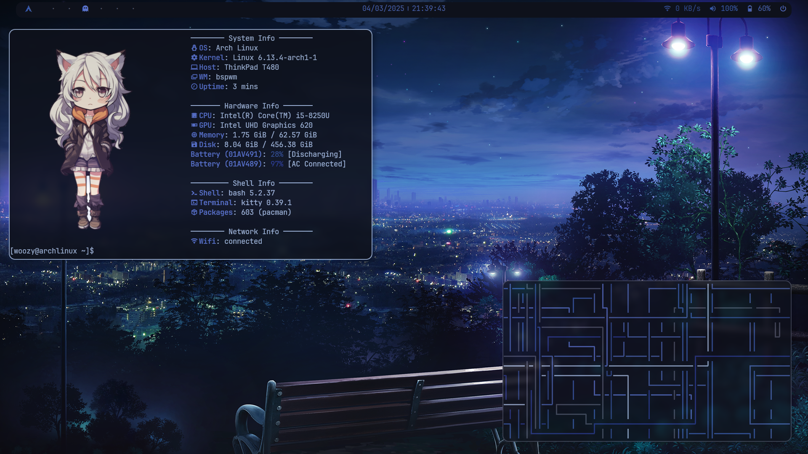
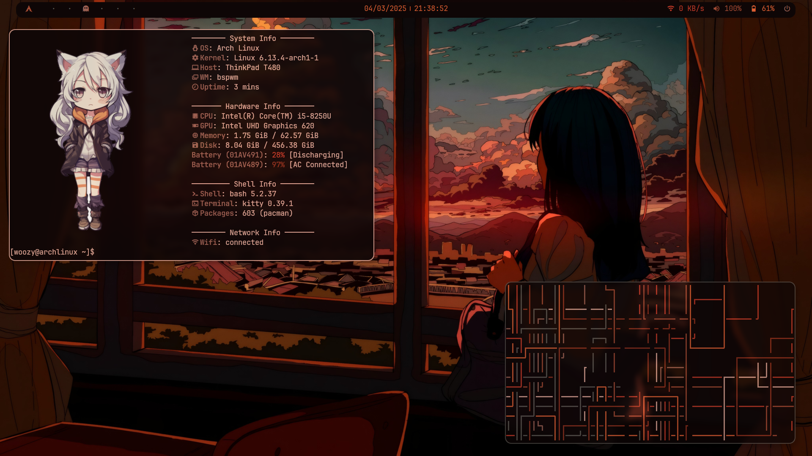

# 🚀 My Arch Linux Setup for Thinkpad T480 ✨

Welcome to my **minimal, efficient, and visually stunning** Arch Linux configuration, fine-tuned for the **Thinkpad T480**. This setup is designed to be **lightweight, fast, and highly customizable**, delivering a modern experience while maximizing system performance.  

🎨 **Dynamic Theming**  
🔧 **Highly Modular & Configurable**  
🔥 **Optimized for Productivity & Aesthetics**

---

## 📌 Table of Contents
- [🖥️ Display & Window Management](#-display--window-management)
- [⌨️ Shortcut Manager](#-shortcut-manager)
- [💬 Notifications & 📸 Screenshots](#-notifications--screenshots)
- [🎨 Aesthetics](#-aesthetics)
- [🛠️ Utilities & Custom Scripts](#-utilities--custom-scripts)
- [📷 Screenshots](#-screenshots)
- [📜 License](#-license)

---

## 🖥️ Display & Window Management

- **Display Manager:** X11  
  📌 Ensures stability and compatibility across a wide range of applications.  

- **Window Manager:** [bspwm](https://github.com/baskerville/bspwm)  
  📌 A **lightweight tiling window manager** that provides full keyboard-driven control for a smooth workflow.

---

## ⌨️ Shortcut Manager

- **Shortcut Daemon:** [sxhkd](https://github.com/baskerville/sxhkd)  
  📌 Used to bind all essential key shortcuts for navigating bspwm efficiently.

### 🏷️ **BSPWM Shortcuts**

| 🔥 Shortcut                                  | 🎯 Action                                          |
|----------------------------------------------|--------------------------------------------------|
| **Super + Return**                           | Open terminal (Kitty)                           |
| **Super + P**                                | Launch application menu (rofi)                  |
| **Super + Escape**                           | Reload sxhkd configuration                      |
| **Super + Alt + R**                          | Quit/Restart bspwm                              |
| **Super + Q**                                | Close or kill focused window                    |
| **Super + M**                                | Toggle between tiled and monocle layouts        |
| **Super + T**                                | Toggle tiled mode                               |
| **Super + Shift + T**                        | Toggle pseudo-tiled mode                        |
| **Super + F**                                | Toggle floating mode                            |
| **Super + S**                                | Toggle fullscreen mode                          |
| **Super + Left/Down/Up/Right**               | Move focus between windows                      |
| **Super + Shift + Left/Down/Up/Right**       | Swap window positions                           |
| **Super + 1-9/0**                            | Switch to specific workspace                    |
| **Super + Alt + Left/Right**                 | Navigate between workspaces                     |
| **Super + Right Mouse**                      | Move floating window                            |
| **Super + Left Mouse**                       | Resize floating window                          |
| **Super + Alt + Ctrl + Arrows**              | Expand/contract window                          |

---

## 💬 Notifications & 📸 Screenshots

- **Notification Manager:** [dunst](https://github.com/dunst-project/dunst)  
  📌 Lightweight, fully customizable notification system.

- **Screenshot Utility:** [scrot](https://github.com/resurrecting-open-source-projects/scrot)  
  📌 Simple and fast screenshot utility.

📸 **Screenshot Shortcuts**
| 🎯 Shortcut          | 📷 Action                               |
|----------------------|--------------------------------------|
| **Super + Print**    | Capture entire screen               |
| **Super + Shift + S**| Capture a selected region          |
| **Super + Shift + C**| Copy screenshot to clipboard       |

---

## 🎨 Aesthetics

- **Wallpaper & Theme Manager:** [pywal](https://github.com/dylanaraps/pywal)  
  🎨 Automatically generates a color scheme based on your chosen wallpaper.

- **App Launcher:** [rofi](https://github.com/davatorium/rofi)  
  🔍 A modern and customizable application launcher.

- **Status Bar:** [polybar](https://github.com/polybar/polybar)  
  📊 Displays useful system information in a modular way.

- **Lockscreen:** [betterlockscreen](https://github.com/betterlockscreen/betterlockscreen)  
  🔒 Beautiful and minimal lock screen with blur effects.

- **Compositor:** [picom](https://github.com/yshui/picom)  
  🖼️ Provides transparency, animations, and window shadows.

- **Fonts:**
  - **JetBrains Mono:** [ttf-jetbrains-mono](https://www.jetbrains.com/lp/mono/) for a clean coding experience.
  - **Material Design Icons:** [ttf-material-design-icons-desktop-git](https://pictogrammers.com/library/mdi/) for a modern UI look.

---

## 🛠️ Utilities & Custom Scripts

- **Terminal Emulator:** [Kitty](https://github.com/kovidgoyal/kitty)  
  ⚡ A fast GPU-based terminal emulator.

- **Shell:** [Zsh](https://www.zsh.org/)  
  🖥️ An advanced and customizable shell with **Oh My Zsh**.

- **Power & Audio Management:**  
  🔋 **TLP & Powertop:** Optimize power consumption.  
  🔊 **Pipewire & Wireplumber:** Modern audio backend with low latency.

- **Custom Scripts:**  
  🛠 **Dual Battery Monitor** → Displays T480 dual battery status with dynamic icons.  
  🎵 **Now Playing Script** → Displays currently playing song from Spotify/Youtube.  
  🌄 **Wallpaper & Theme Updater** → Applies pywal themes dynamically.  
  🔊 **Volume & Brightness Controls** → Keybindings for media controls.  
  📸 **Screenshot Script** → Saves and notifies you after capturing.  

**All custom scripts are in** `~/.local/bin/` **and are automatically made executable during installation.**

---

## 📷 Screenshots

Here’s how this setup looks in action:

---

## 📜 License

This project is licensed under the **MIT License**.  
Feel free to modify, distribute, and use this configuration in accordance with the license terms.

---

🔥 **Enjoy your minimal, efficient, and aesthetically pleasing Arch experience on the Thinkpad T480!** 🚀
