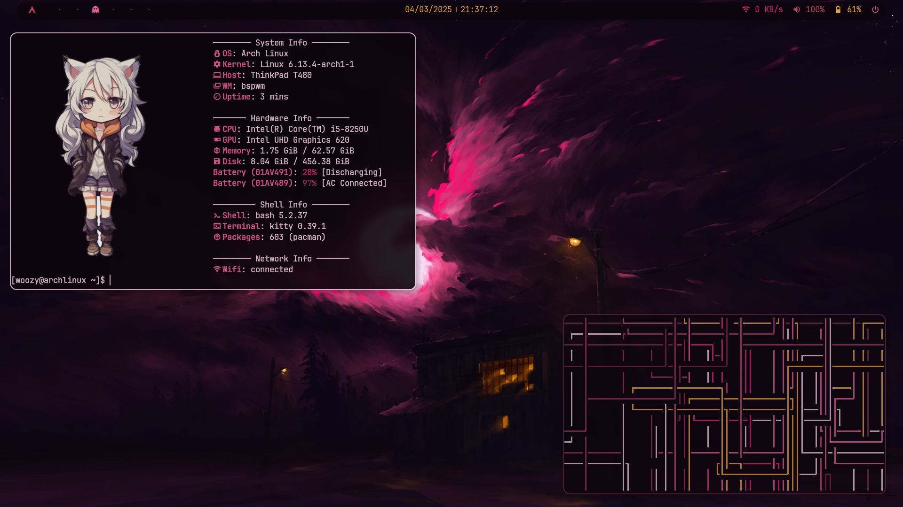
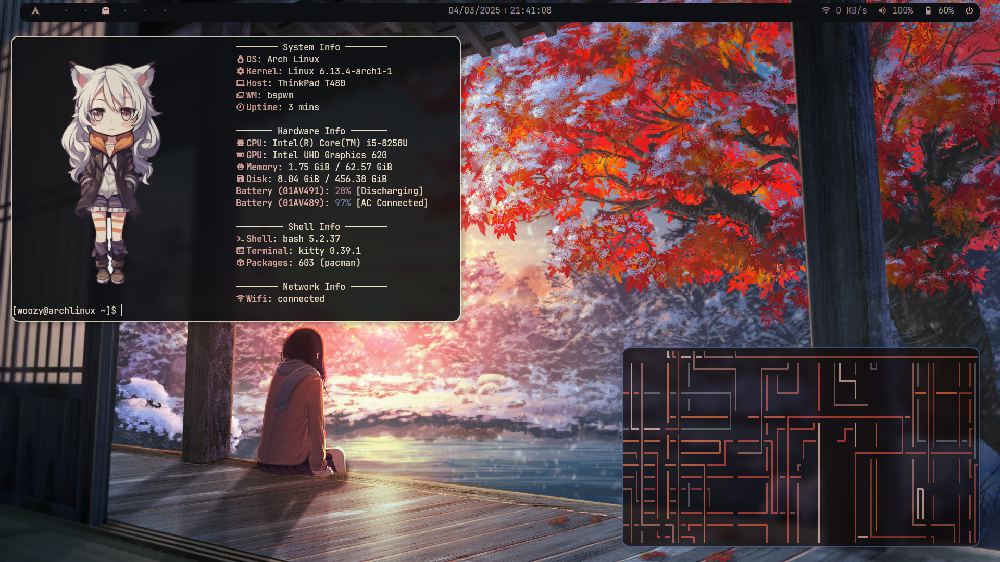

# My Arch Config ✨

## Display Manager 🖥️
- **Display Manager:** X11

## Window Manager 🪟
- **Window Manager:** [bspwm](https://github.com/baskerville/bspwm)

## Shortcut Manager ⌨️
- **Shortcut Manager:** [sxhkd](https://github.com/baskerville/sxhkd)
- **BSPWM Shortcuts**

| Shortcut                                     | Description                                          |
|----------------------------------------------|------------------------------------------------------|
| Super + Return                               | Open terminal (kitty)                                |
| Super + P                                    | Launch program launcher (rofi -show drun)            |
| Super + Escape                               | Reload sxhkd configuration files                     |
| Super + Alt + R                              | Quit/restart bspwm                                   |
| Super + Q                                    | Close or kill window                                 |
| Super + M                                    | Toggle between tiled and monocle layout              |
| Super + T                                    | Toggle tiled mode                                    |
| Super + Shift + T                            | Toggle pseudo-tiled mode                             |
| Super + F                                    | Toggle floating mode                                 |
| Super + S                                    | Toggle fullscreen mode                               |
| Super + Left/Down/Up/Right                   | Focus node in specified direction                    |
| Super + Shift + Left/Down/Up/Right           | Swap node with adjacent node in specified direction  |
| Super + 1-9/0                                | Focus on or send window to specified desktop         |
| Super + Alt + Left/Right                     | Focus the next/previous desktop in the current monitor |
| Super + Right Mouse                          | Move floating window                                 |
| Super + Left Mouse                           | Resize floating window                               |
| Super + Alt + Control + Left/Down/Up/Right   | Expand/contract window                               |

## Notification Manager 💬
- **Notification Manager:** [dunst](https://github.com/dunst-project/dunst)

## Screenshot Manager 📸
- **Screenshot Manager:** [scrot](https://github.com/resurrecting-open-source-projects/scrot)

## Aesthetics 🎨
- **Wallpaper Manager:** [pywal](https://github.com/dylanaraps/pywal)
- **App Launcher:** [rofi](https://github.com/davatorium/rofi)
- **Status Bar:** [polybar](https://github.com/polybar/polybar)
- **Compositor:** [picom](https://github.com/yshui/picom)
- **Fonts:**

      JetBrains Mono - ttf-jetbrains-mono
      Material Design Icons - ttf-material-icons-git

## Utilities 🛠️
- **Terminal:** [Kitty](https://github.com/kovidgoyal/kitty)
- **Shell:** [Zsh](https://www.zsh.org/)

## Credits 🌟

- [verttj/dotfiles-ltint](https://github.com/verttj/dotfiles-ltint) for providing inspiration for Polybar configuration.
- [ericmurphyxyz/rofi-wifi-menu](https://github.com/ericmurphyxyz/rofi-wifi-menu) for the Rofi WiFi menu.
